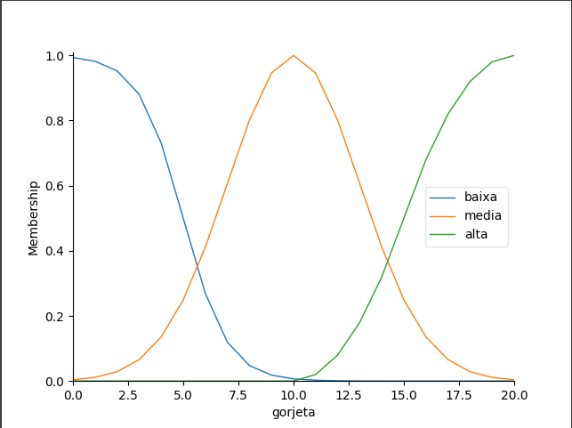
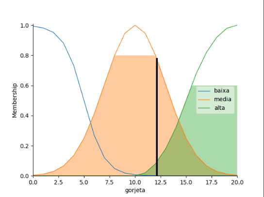

# **Lógica Fuzzy**
> A Lógica Fuzzy comumente tratada como uma extensão da lógica booleana, é uma lógica multivalorada capaz de capturar informações vagas, em geral descritas em uma linguagem natural, e convertê-las para um formato numérico.
>* Um valor lógico difuso, conhecido por grau de pertinência, é um valor qualquer no intervalo [0, 1].

> As implementações da lógica difusa permitem que estados não precisos possam ser tratados por dispositivos de controle.
> * Desse modo, é possível avaliar conceitos não quantificáveis.
> * Casos práticos: 
>  * Avaliar a temperatura (quente, morno, frio, ...).
>  * Altura (Alto, médio, baixo).

## Fuzificação
* Etapa na qual as variáveis linguísticas são definidas de forma subjetiva, bem como as funções membro (funções de pertinência)

* Engloba:
  * Análise do Problema
  * Definição das Variáveis
  * Definição das Funções de pertinência
  * Criação das Regiões

* Na definição das funções de pertinência para cada variável, diversos tipos de espaços podem ser gerados:
* Sigmóide, Gaussiana, Pi-function ...

##Instação do pacote skfuzzy
```pycon
 pip install scikit-fuzzy
 ```

## Antecedentes 

```pycon
qualidade = ctrl.Antecedent(np.arange(0, 11, 1), 'qualidade')
servico = ctrl.Antecedent(np.arange(0, 11, 1), 'servico')
```

## Consequente

```pycon
gorjeta = ctrl.Consequent(np.arange(0, 21, 1), 'gorjeta')
```

## MemberShip functions 

```pycon
qualidade.automf(number=3, names=['ruim', 'boa', 'saborosa'])
servico.automf(number=3, names=['ruim', 'aceitável', 'ótimo'])

gorjeta['baixa'] = fuzz.sigmf(gorjeta.universe, 5, -1)
gorjeta['media'] = fuzz.gaussmf(gorjeta.universe, 10, 3)
gorjeta['alta'] = fuzz.pimf(gorjeta.universe, 10, 20, 25, 50)
gorjeta.view()
```




## Regras

```pycon
regra1 = ctrl.Rule(qualidade['ruim'] | servico['ruim'], gorjeta['baixa'])
regra2 = ctrl.Rule(servico['aceitável'], gorjeta['media'])
regra3 = ctrl.Rule(servico['ótimo'] | qualidade['saborosa'], gorjeta['alta'])
```

## Sistema de Controle

```pycon
sistema_controle = ctrl.ControlSystem([regra1, regra2, regra3])
sistema = ctrl.ControlSystemSimulation(sistema_controle)

while True:
  notaQualidade = float(input('Digite a qualidade: '))
  if(notaQualidade < 0 or notaQualidade > 10):
    print('A qualidade deve estar no intervalo [0, 10]')
    continue
  sistema.input['qualidade'] = notaQualidade
  break

while True:
  notaServico = float(input('Digite o serviço: '))
  if(notaServico < 0 or notaServico > 10):
    print('O serviço deve estar no intervalo [0, 10]')
    continue
  sistema.input['servico'] = notaServico
  break

sistema.compute()
print(sistema.output['gorjeta'])
gorjeta.view(sim=sistema)
```

# Resultado

* Levando em consideração um estabelecimento com qualidade 8 e serviço 6 teríamos como resultado:
  

